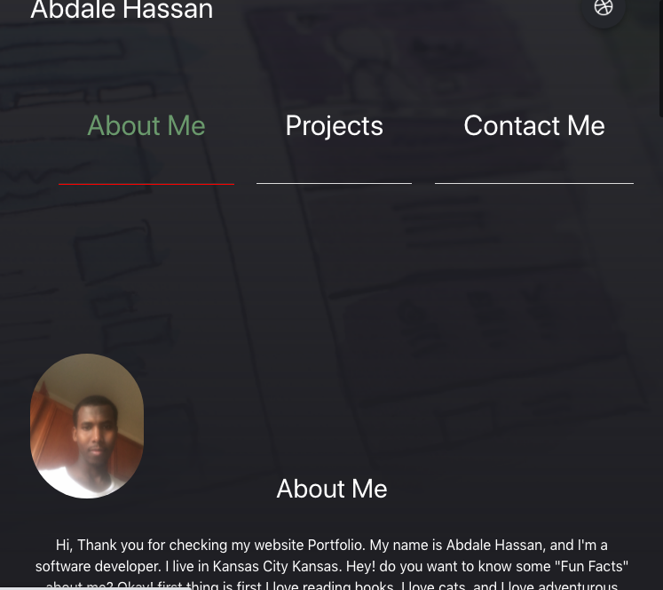

## Portfolio

## License
   GitHub License 
   
## Description
 This is my first portfolio as a software developer, and it will not be the last. Moreover, This portfolio will lay out the foundation of incremental learning in software development. As a software developer, it is my duty to improve my portfolio again and again so it stands out from the crowd. Hence, I will do my best to educate myself and improve my portfolio as a result.    
   
   ## Table of Contents

   * [Installation](#installation)

   * [Usage](#usage)

   * [License](#license)

   * [Contribution](#contributing)

   * [Testing](#testing)

   * [Questions](#questions)
   * [technologies](#technologies)

## Installation
  N/A

## Usage
 Please run the link to see portfolio page

## License
This project is licensed under the MIT license.
 
 

## Contributing
 N/A

## Testing
 N/A

## Questions
Please shoot me an email for more info
cabdale989@gmail.com
![]https://github.com/Abdale88
     
    

## technologies
1. HTML
2. CSS
3. bulma framework

## Link to this app
https://abdale88.github.io/02_Portfolio/

## License and copyright

[Licence](https://github.com/Abdale88/02_Portfolio/blob/main/license/mylicense)
